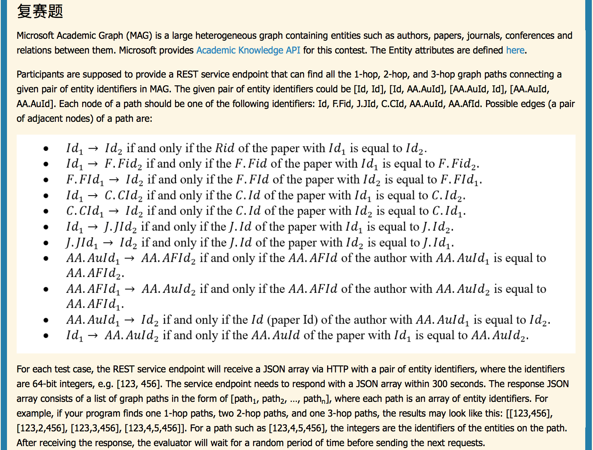

# BOPjersey
Code for 2016 Microsoft Beauty of Programming Contest

RESTful url:   
http://{your_ip}/BOPjersey/bop/rest  
把项目生成的BOPjersey.war放在tomcat的webapps目录下

**思路：**  

判断给定的参数id是Id还是AuId：  
发请求expr=Composite(AA.AuId=id)&attributes=Id,AA.AuId,AA.AfId，如果返回的entities长度为0，则为Id，否则为AuId。而且当为AuId时，该请求所得结果可以直接用于后续计算，避免后面重复发送同样的请求
***

**[id1,id2]**  
2-hop：[id1-other-id2]和[id1-id3-id2]  
请求一：expr=Or(Id=id1,Id=id2)&attributes=RId,J.JId,C.CId,F.FId,AA.AuId
=>id1.RId, id1.Other 和 id2.Other  
请求二：expr=RId=Id2&attributes=Id
=>{id3 | id3.RId==id2}  
然后对 id1.Other 和 id2.Other 求交集（hashset），对id1.RId和 {id3| id3.RId==id2} 求交集

1-hop：从id1.RId中找里面是否有id2

3-hop：  
  1）可以有环 && 1-hop存在：id1 -> id2 ->  id2.Other -> id2  
  2)  
  a) [id1-id4-id3-id2]和[id1-id4-other-id2] :  
  把id1.RId中的所有Id（除了Id2以外），指定几个为一组，使用
  expr=Or(Or(Id=a,Id=b),Or(Id=c,Id=d))&attributes=Id,RId,J.JId,C.CId,F.FId,AA.AuId
  的形式，求出id1.RId[index].RId和id1.RId[index].Other，然后求每个id1.RId[index].RId与{id3|id3.RId==id2}交集，以及每个id1.RId[index].Other与id2.Other的交集；  
b) [id1-other-id3-id2] :  
把{id3}中的所有Id，指定几个为一组，使用
expr=Or(Or(Id=a,Id=b),Or(Id=c,Id=d))&attributes=Id,J.JId,C.CId,F.FId,AA.AuId
的形式，求出{id3}[index].Other，
然后分别与id1.Other 求交集
***  
**[id, AuId]**  
expr=Id=id&attributes=RId,J.JId,C.CId,F.FId,AA.AuId
=> id.RId, id.Other, id.AuId
expr=Composite(AA.AuId=AuId)&attributes=Id,AA.AuId,AA.AfId
=> {id2 | id2<->AuId}, AuId.AfId

1-hop：从{id2}中找里面是否有id  
2-hop：[id-id2-AuId]  
求id.RId和{id2}的交集即可  
3-hop：  
a)
[id-other-id2-AuId]：把{id2}中的每一个元素id2[index]按照expr=Or(Or(Id=a,Id=b),Or(Id=c,Id=d))&attributes=Id,J.JId,C.CId,F.FId,AA.AuId
的形式，求出id2[index].Other，然后分别与id.Other求交集  
b)
[id-id3-id2-AuId]：把id.RId中的每个元素id.RId[index]，按照expr=Or(Or(Id=a,Id=b),Or(Id=c,Id=d))&attributes=Id,RId
的形式，求出id.RId[index].RId，然后分别与{id2}求交集  
c)
[id-AuId2-AfId-AuId]：(多线程or拼起来or分着发请求)把id.AuId中的每个元素id.AuId[index]（除去AuId，如果有等于AuId的那个，单独算）按照expr=Composite(AA.AuId=a)&attributes=AA.AuId,AA.AfId的形式，找出id.Auid[index].AfId，然后分别与AuId.AfId求交集
***
**[AuId, Id]**  
expr=Id=id&attributes=J.JId,C.CId,F.FId,AA.AuId
=> Id.Other, Id.AuId  
expr=RId=Id&attributes=Id
=> {id3 | id3.RId==Id}  
expr=Composite(AA.AuId=AuId)&attributes=Id,AA.AuId,AA.AfId
=> {id2 | id2<->AuId}, AuId.AfId

1-hop：从{id2}中找里面是否有Id  
2-hop：[AuId-id2-Id]
求{id2}与{id3}的交集即可  
3-hop：  
a) [AuId-id2-other-Id]和[AuId-id2-id3-Id]：  
把{id2}中的每一个元素id2[index]按照expr=Or(Or(Id=a,Id=b),Or(Id=c,Id=d))&attributes=Id,RId,J.JId,C.CId,F.FId,AA.AuId
的形式，求出id2[index].Other和id2[index].RId，然后分别与Id.Other和{id3}求交集  
b)[AuId-AfId-AuId2-Id]：  
如果Id.AuId包含AuId，则单独算出一类3-hop路径—AuId-AuId.AfId-AuId-Id，然后对于剩余的每个Id.AuId[index]，按照expr=Composite(AA.AuId=a)&attributes=AA.AuId,AA.AfId的形式，找出id.Auid[index].AfId，然后分别与AuId.AfId求交集
***

**[AuId1, AuId2]**  
expr=Composite(AA.AuId=AuId1)&attributes=Id,AA.AuId,AA.AfId
=> {id1| id1<->AuId1},
AuId1.AfId  
expr=Composite(AA.AuId=AuId2)&attributes=Id,AA.AuId,AA.AfId
=> {id2| id2<->AuId2},
AuId2.AfId

没有1-hop  
2-hop：  
a)
[AuId1-id-AuId2]：求{id1}与{id2}的交集  
b)
[AuId1-AfId-AuId2]：求AuId1.AfId与AuId2.AfId的交集  
3-hop：[AuId1-id1-id2-AuId2]  
对于{id1}中的每一个元素{id1}[index]，按照expr=Or(Or(Id=a,Id=b),Or(Id=c,Id=d))&attributes=Id,RId
的形式，
求出{id1}[index].RId，然后分别与{id2}求交集
***

**注**  
get请求最大长度为2048，因此expr表达式长度设为1800  
Id的最大长度为基本为10（但目前是按照最大19考虑的）  
Or()操作拼64个Id  
query最大条数count目前只设为10000，对于各别论文，这个值是不够的，可以多获取一个CC（Citation count）字段，根据此字段值的大小决定count设为多少  
***

**RESTful参考资料**  
[how-to-build-restful-service-with-java-using-jax-rs-and-jersey](http://crunchify.com/how-to-build-restful-service-with-java-using-jax-rs-and-jersey/)

[restful](http://wiki.jikexueyuan.com/project/restful/)

[jersey-25-maven-easy-rest-web-services](http://poor-developer.blogspot.com/2014/02/jersey-25-maven-easy-rest-web-services.html)

[maven-dynamic-web-project](http://poor-developer.blogspot.com/2014/02/maven-dynamic-web-project-ouch-how-do-i.html)

[tomcat](http://www.cnblogs.com/pannysp/archive/2012/03/07/2383364.html)

